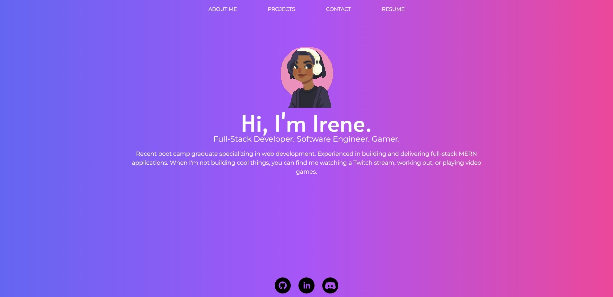

# React Portfolio

## Description

This is the latest iteration of my portfolio, revamped and built with React. It acts as a showcase for my web development projects and offers ways to contact me.

## Usage/Preview

My portfolio is a single-page application. Users can render different sections by clicking the tabs at the top of the page. There are four pages: About Me, Projects, Contact, and Resume. 

The 'About Me' page is the default landing spot and provides a short summary of my experience and my hobbies. 'Projects' displays some of the work that I've done. 'Contact' contains a form for contacting me, though it is not functional yet. In the meantime, my email and phone number are listed below it. The 'Resume' page lists my technological proficiencies and contains a download link to my resume in PDF form should users choose to view that instead.

The footer contains links to my GitHub profile, LinkedIn profile, and Discord profile.

Live: [irenepanis.netlify.app](https://irenepanis.netlify.app/)

## Technologies Used
* React.js
* Tailwind CSS

## Credits

Avatar image courtesy of Lu Nascimento ([@viiolaceus](https://twitter.com/viiolaceus) on Twitter). Create your own avatar [here](https://picrew.me/image_maker/112842).

## License

N/A
